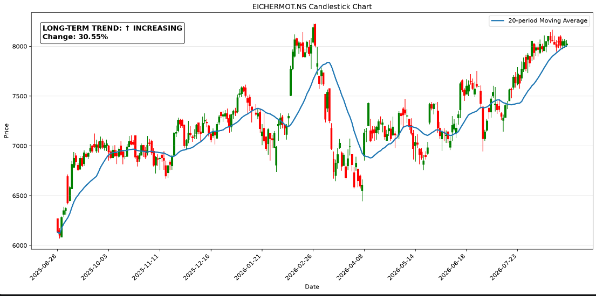
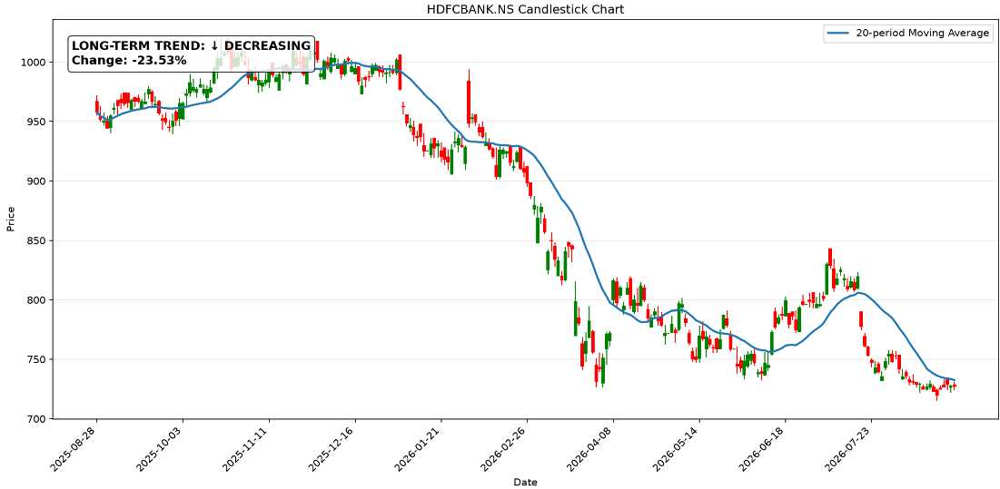
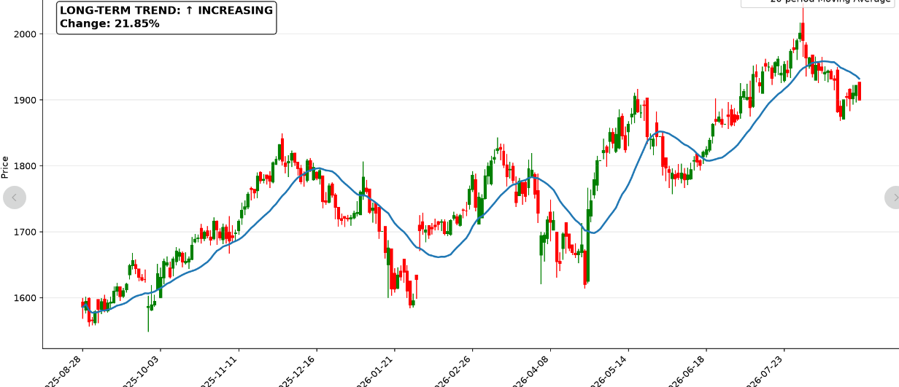
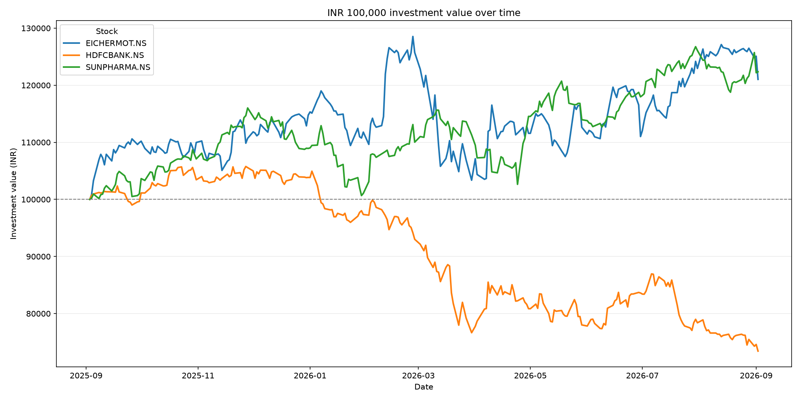
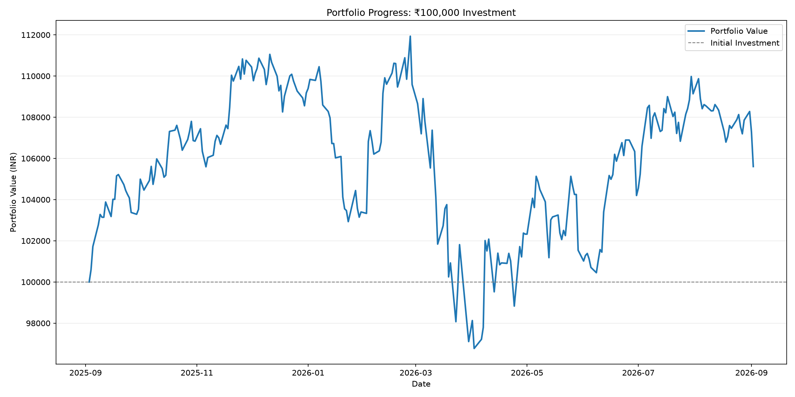

# Stock Analysis Claims

## Overview

John wants to analyze different stocks and understand how investment strategies can impact portfolio growth, risk, and returns.

The analysis focuses on three key claims:

1. Long-term investment helps grow capital.
2. Investing across different sectors helps reduce risk and improve portfolio stability.
3. Diversifying investments across multiple stocks can improve risk-adjusted returns.

---

# Claim 1: Long-term investment helps grow the capital John currently has

## Description

John wants to understand whether holding stocks for a longer period can help increase the value of his initial investment.

This claim analyzes the historical performance of selected stocks and determines whether long-term investing leads to capital appreciation.

## Analysis Approach

The analysis can include:

- Comparing stock prices over a long period.
- Calculating overall percentage returns.
- Measuring annual growth using CAGR (Compound Annual Growth Rate).
- Identifying whether the stock consistently increased in value over time.

## Visualizations

### Stock Price Growth Over Time

---

# Claim 2: Investing in different sectors helps reduce risk and improve portfolio stability

## Description

John wants to understand whether investing in companies from different sectors provides better protection against market fluctuations.

For example, investing in IT, banking, and automobile sectors may reduce the impact of poor performance in one specific industry.

## Analysis Approach

The analysis can include:

- Comparing volatility of stocks from different sectors.
- Measuring correlation between stock movements.
- Understanding whether different sectors react differently to market changes.

## Visualizations

### CAGR Growth Analysis

---

# Claim 3: Diversifying investments across multiple stocks can improve risk-adjusted returns

## Description

John wants to analyze whether creating a diversified portfolio provides better returns while managing risk compared to investing in a single stock.

A diversified portfolio spreads investments across multiple companies, reducing dependency on the performance of one stock.

## Analysis Approach

The analysis can include:

- Comparing a single-stock portfolio against a diversified portfolio.
- Measuring portfolio growth over time.
- Comparing risk and return trade-offs.
- Evaluating whether diversification improves overall investment performance.

## Visualizations

### Portfolio Growth Comparison

# Conclusion

These three claims help John understand:

- Whether long-term investing can increase wealth.
- Whether sector diversification can reduce investment risk.
- Whether a diversified portfolio can provide better risk-adjusted returns.

Together, these analyses provide insights into making informed investment decisions.