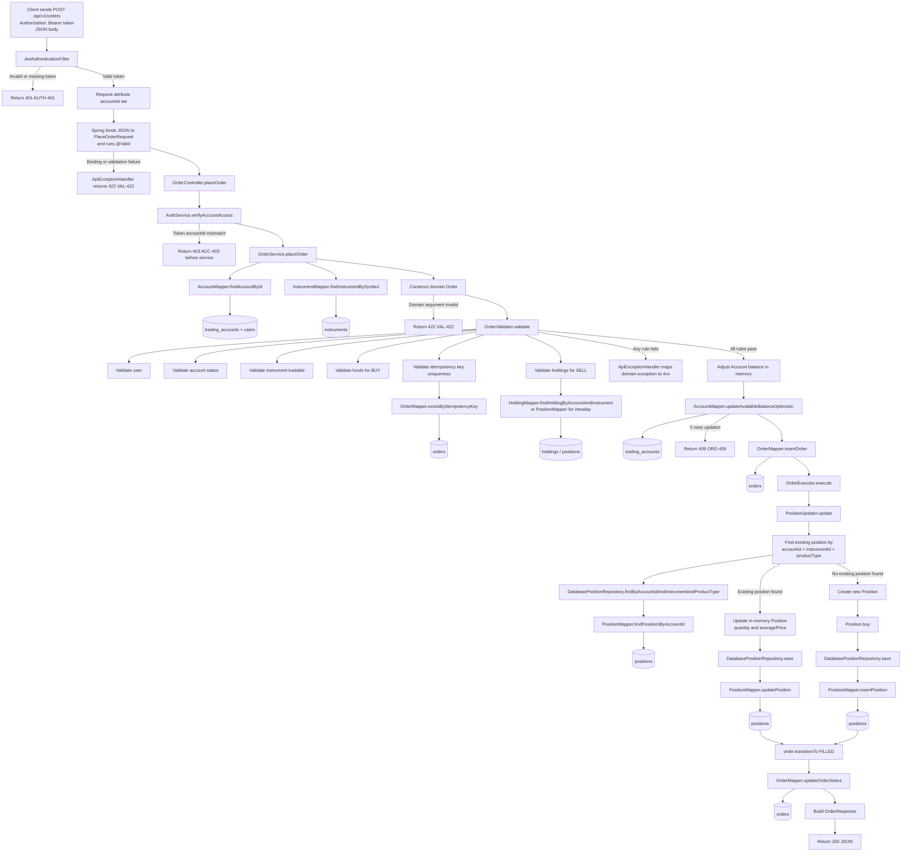

# Place Order Request Flow

This document explains how a `POST /api/v1/orders` request moves through the Sprint 6 Spring Boot application, starting at the HTTP layer and ending in the database, then back out as an API response.

It focuses on the current implementation in these files:

- `spring-boot-app/src/main/java/com/tradingsystem/spring_boot_app/security/JwtAuthenticationFilter.java`
- `spring-boot-app/src/main/java/com/tradingsystem/spring_boot_app/controller/OrderController.java`
- `spring-boot-app/src/main/java/com/tradingsystem/spring_boot_app/service/AuthService.java`
- `domain-engine/src/main/java/com/tradingsystem/domain/dto/PlaceOrderRequest.java`
- `spring-boot-app/src/main/java/com/tradingsystem/spring_boot_app/service/OrderService.java`
- `domain-engine/src/main/java/com/tradingsystem/domain/services/OrderValidator.java`
- `domain-engine/src/main/java/com/tradingsystem/domain/services/OrderExecutor.java`
- `domain-engine/src/main/java/com/tradingsystem/domain/services/PositionUpdater.java`
- `spring-boot-app/src/main/java/com/tradingsystem/spring_boot_app/mapper/AccountMapper.java`
- `spring-boot-app/src/main/java/com/tradingsystem/spring_boot_app/mapper/InstrumentMapper.java`
- `spring-boot-app/src/main/java/com/tradingsystem/spring_boot_app/mapper/OrderMapper.java`
- `spring-boot-app/src/main/java/com/tradingsystem/spring_boot_app/mapper/PositionMapper.java`
- `spring-boot-app/src/main/java/com/tradingsystem/spring_boot_app/mapper/HoldingMapper.java`
- `spring-boot-app/src/main/java/com/tradingsystem/spring_boot_app/exception/ApiExceptionHandler.java`

## High-Level Flow

## 1. Request Entry: Security Filter Before Controller

The request does not go straight to the controller. Every `/api/v1/**` route first passes through `JwtAuthenticationFilter`.

### File

- `spring-boot-app/src/main/java/com/tradingsystem/spring_boot_app/security/JwtAuthenticationFilter.java`

### What it does

1. Checks that the request path starts with `/api/v1/`.
2. Reads the `Authorization` header.
3. Verifies the header starts with `Bearer `.
4. Passes the raw token to `JwtTokenProvider`.
5. If valid, extracts the JWT `accountId` claim.
6. Stores that `accountId` on the request as an attribute.

### Failure behavior

If the token is missing, malformed, expired, or signed incorrectly, the filter returns immediately with:

- HTTP `401`
- Error code `AUTH-401`

The controller is never reached in that case.

## 2. Controller Layer: HTTP to Application Call

### File

- `spring-boot-app/src/main/java/com/tradingsystem/spring_boot_app/controller/OrderController.java`

### Method

`placeOrder(@Valid @RequestBody PlaceOrderRequest body, HttpServletRequest request)`

### What happens here

The controller has two main responsibilities for a place-order request:

1. Accept the HTTP request body and let Spring convert JSON into `PlaceOrderRequest`.
2. Verify that the authenticated account in the JWT is allowed to place an order for the `accountId` in the body.

The controller itself does not talk to the database and does not apply trading rules. It delegates business logic to `OrderService`.

### Security check inside controller flow

Before calling the service, the controller calls:

`authService.verifyAccountAccess(request, body.getAccountId())`

That check compares:

- `accountId` from the JWT, placed on the request by the filter
- `accountId` from the request body

If they do not match, the request fails with:

- HTTP `403`
- Error code `ACC-403`

## 3. DTO Validation: JSON Binding and Domain Constructor Guardrails

### File

- `domain-engine/src/main/java/com/tradingsystem/domain/dto/PlaceOrderRequest.java`

### Validation layers in this class

This DTO is validated in two overlapping ways.

#### A. Jakarta Bean Validation annotations

The fields carry constraints such as:

- `@NotNull`
- `@Min(1)`
- `@Size(min = 1, max = 20)`
- `@DecimalMin("0.01")`
- `@Digits(integer = 17, fraction = 2)`

Because the controller parameter is marked `@Valid`, Spring validation runs during request binding.

#### B. Constructor-level defensive validation

The DTO constructor also throws `InvalidOrderArgumentException` if any field is invalid.

That means invalid payloads can fail from either:

- Spring bean validation
- Manual constructor checks

### Fields validated

The request body must contain:

- `accountId`
- `symbol`
- `side`
- `quantity`
- `price`
- `idempotencyKey`

### Failure behavior

Validation failures are translated by `ApiExceptionHandler` into:

- HTTP `422`
- Error code `VAL-422`

## 4. Service Layer: Orchestration of the Place-Order Use Case

### File

- `spring-boot-app/src/main/java/com/tradingsystem/spring_boot_app/service/OrderService.java`

### Method

`placeOrder(PlaceOrderRequest request)`

This is the core orchestration layer. It coordinates the read side, domain validation, persistence updates, and the final response object.

The method is marked `@Transactional`, so Spring wraps the method in a database transaction boundary for the mapper calls it issues.

## 5. Read Side: Service Uses Mappers to Load Domain Inputs

Before the service can construct an `Order`, it loads the current `Account` and `Instrument`.

### Account lookup

#### File

- `spring-boot-app/src/main/java/com/tradingsystem/spring_boot_app/mapper/AccountMapper.java`

#### Mapper method

`findAccountById(Long accountId)`

#### SQL role

Reads from `trading_accounts` and hydrates an immutable domain `Account`.

Important detail: this mapper also resolves the nested `holder` field using `UserMapper.findUserById`, so the service receives a fully usable domain `Account`, not just raw columns.

#### Failure behavior

If no row exists, `OrderService` throws `AccountNotFoundException`, which becomes:

- HTTP `404`
- Error code `ACC-404`

### Instrument lookup

#### File

- `spring-boot-app/src/main/java/com/tradingsystem/spring_boot_app/mapper/InstrumentMapper.java`

#### Mapper method

`findInstrumentBySymbol(String symbol)`

#### SQL role

Reads from `instruments` and hydrates an immutable domain `Instrument`.

#### Failure behavior

If no instrument matches, `OrderService` throws `InstrumentNotFoundException`, which becomes:

- HTTP `404`
- Error code `INS-404`

## 6. Domain Construction: DTO to Order Entity

After loading the account and instrument, the service constructs a domain `Order`.

### Current construction path

Inside `OrderService.placeOrder`, the service builds:

- `orderId` from `OrderMapper.nextOrderId()`
- the loaded `Account`
- the loaded `Instrument`
- `OrderType.LIMIT`
- request `side`
- `ProductType.DELIVERY`
- request `quantity`
- request `price`
- `stopPrice = null`
- request `idempotencyKey`

### Important implication

The API request only exposes a single `price` field. In the current implementation, that price becomes the domain `limitPrice`, and all placed orders are created as `LIMIT` + `DELIVERY` orders.

### Domain safeguards

The `Order` constructor performs its own invariants, such as:

- non-null account and instrument
- positive quantity
- allowed decimal scale for prices
- required limit price for limit orders
- non-blank idempotency key

If that constructor throws `InvalidOrderArgumentException`, the exception handler converts it to:

- HTTP `422`
- Error code `VAL-422`

## 7. Domain Validation: Trading Rules Enforced in Order

### File

- `domain-engine/src/main/java/com/tradingsystem/domain/services/OrderValidator.java`

### How it is wired

`OrderService` creates an `OrderValidator` with database-backed adapters:

- `DatabasePositionRepository`
- `DatabaseHoldingRepository`
- inline `MarketPriceProvider`
- `DatabaseIdempotencyStore`

These adapters bridge domain interfaces to Spring Boot MyBatis mappers.

### Validation order

The validator enforces rules in this sequence:

1. `validateUser(order)`
2. `validateAccount(order)`
3. `validateInstrument(order)`
4. `validateFunds(order)`
5. `validateIdempotencyOrder(order)`
6. `validateSellAvailability(order)`

That order matters because the first failure stops later rules.

### Database participation during validation

Some rules are pure in-memory checks on the hydrated domain objects:

- user status
- account trading status
- instrument tradability
- buy affordability based on loaded account balance

Other rules call back into persistence:

#### Idempotency check

- Adapter: `DatabaseIdempotencyStore.exists`
- Mapper: `OrderMapper.existsByIdempotencyKey`
- Table: `orders`

#### Sell holdings check

- Adapter: `DatabaseHoldingRepository.findByAccountIdAndInstrument`
- Mapper: `HoldingMapper.findHoldingByAccountAndInstrument`
- Table: `holdings`

#### Intraday position check

- Adapter: `DatabasePositionRepository.findByAccountIdAndInstrumentAndProductType`
- Mapper: `PositionMapper.findPositionsByAccountId`
- Table: `positions`

### Failure mapping

Examples:

- `AccountNotActiveException` -> `403 ACC-403`
- `InstrumentDelistedException` -> `404 INS-404`
- `InsufficientFundsException` -> `400 ORD-400`
- `InsufficientHoldingsException` -> `409 ORD-409`
- `DuplicateOrderException` -> `409 ORD-409`

Those mappings are defined in `ApiExceptionHandler`.

## 8. Persistence Phase: Writing Account and Order Data

Once validation passes, `OrderService.placeOrder` starts mutating state.

### 8.1 Update cash balance in memory

The service computes:

`tradeValue = request.getPrice() * request.getQuantity()`

Then:

- for `BUY`: `account.debit(tradeValue)`
- for `SELL`: `account.credit(tradeValue)`

This changes the domain `Account` object in memory first.

### 8.2 Persist cash balance with optimistic locking

#### File

- `spring-boot-app/src/main/java/com/tradingsystem/spring_boot_app/mapper/AccountMapper.java`

#### Mapper method

`updateAvailableBalanceOptimistic(accountId, cashBalance, loadedVersion)`

#### Table

- `trading_accounts`

#### Why this matters

The update only succeeds if the `version` in the row still matches the `loadedVersion` from the earlier read. This prevents lost updates.

If zero rows are updated, the service throws `OptimisticLockException`, which becomes:

- HTTP `409`
- Error code `ORD-409`

### 8.3 Insert order row

#### File

- `spring-boot-app/src/main/java/com/tradingsystem/spring_boot_app/mapper/OrderMapper.java`

#### Mapper method

`insertOrder(Order order)`

#### Table

- `orders`

The insert stores:

- `order_id`
- `trading_account_id`
- `instrument_id`
- `order_type`
- `side`
- `product_type`
- `quantity`
- `limit_price`
- `status = 'NEW'`
- `idempotency_key`
- timestamps

At this point, the order has been recorded in the database.

## 9. Execution Phase: OrderExecutor and Position Updates

### File

- `domain-engine/src/main/java/com/tradingsystem/domain/services/OrderExecutor.java`

After inserting the order, the service executes it synchronously.

### What `OrderExecutor.execute(order)` does

1. Determines execution price.
2. Delegates position changes to `PositionUpdater`.
3. Transitions the order status to `FILLED`.
4. Calls `idempotencyStore.save(order.getIdempotencyKey())`.

### Current execution-price behavior

For the current request path, the order type is `LIMIT`, so execution price resolves to `order.getLimitPrice()`.

## 10. Position Update Path: Domain Service Backed by Mappers

### File

- `domain-engine/src/main/java/com/tradingsystem/domain/services/PositionUpdater.java`

### Adapter used by Spring Boot service

`OrderService` provides a `DatabasePositionUpdater`, which extends `PositionUpdater` and writes through `DatabasePositionRepository`.

### How that repository works

`DatabasePositionRepository` uses `PositionMapper` methods to:

- read existing positions for the account
- find a matching instrument/product pair
- update the existing row, or
- insert a new row if no position exists yet

### Database table touched

- `positions`

### BUY flow

For a buy order:

1. `PositionUpdater` checks whether a position already exists.
2. If it exists, it increases quantity and recalculates average price in the domain object.
3. If not, it creates a new `Position` and persists it.

### SELL flow

For a sell order:

1. Validation should already have confirmed availability.
2. `PositionUpdater` reduces the existing position quantity.

## 11. Final Order Status Update

After `OrderExecutor` transitions the domain order to `FILLED`, the service persists that final state.

### File

- `spring-boot-app/src/main/java/com/tradingsystem/spring_boot_app/mapper/OrderMapper.java`

### Mapper method

`updateOrderStatus(orderId, order.getStatus())`

### Table

- `orders`

So the database write path for a successful place-order request is:

1. update `trading_accounts.available_balance`
2. insert into `orders` with `NEW`
3. insert/update `positions`
4. update `orders.status` to `FILLED`

## 12. Response Path: Database Back to API JSON

The response path for `POST /api/v1/orders` is simpler than the read endpoints.

### Important detail

The controller response is not re-read from the database. Instead, `OrderService.placeOrder` builds `OrderResponse` directly from objects already in memory.

### File

- `spring-boot-app/src/main/java/com/tradingsystem/spring_boot_app/dto/OrderResponse.java`

### What gets returned

The service currently returns:

- `orderId` as `ORD-<numeric id>`
- `status` as `FILLED`
- `message` as `Order executed`
- `symbol`
- `side`
- `quantity`
- `price`

Then the controller wraps that DTO in `ResponseEntity.ok(...)`, and Spring serializes it back to JSON.

## 13. Reverse Read Flow: How Later GET Calls Hydrate Order Data Back Out

Although `POST /api/v1/orders` returns without re-querying the order, later reads such as `GET /api/v1/accounts/{id}/orders` do go through the reverse mapping path.

### Reverse path summary

1. Controller calls `AccountService.getOrders(...)`.
2. Service calls `OrderMapper.findOrdersByAccountId(...)`.
3. `OrderMapper` reads raw columns from `orders`.
4. MyBatis constructor mapping resolves:
   - account via `AccountMapper.findAccountById(...)`
   - instrument via `InstrumentMapper.findInstrumentById(...)`
5. MyBatis builds immutable domain `Order` objects.
6. `AccountService` maps each `Order` to `OrderHistoryEntry`.
7. Spring serializes the list to JSON.

This is the main "database to application to response" path for previously stored orders.

## 14. Error Handling Layer

### File

- `spring-boot-app/src/main/java/com/tradingsystem/spring_boot_app/exception/ApiExceptionHandler.java`

This class translates domain and framework exceptions into stable API responses.

### Examples relevant to place order

- `InvalidOrderArgumentException` -> `422 VAL-422`
- `AccountNotFoundException` -> `404 ACC-404`
- `InstrumentNotFoundException` -> `404 INS-404`
- `AccountNotActiveException` -> `403 ACC-403`
- `InsufficientFundsException` -> `400 ORD-400`
- `DuplicateOrderException` -> `409 ORD-409`
- `OptimisticLockException` -> `409 ORD-409`
- unexpected exceptions -> `500 ERR-500`

This is the last application layer before the HTTP response leaves the service.

## 15. End-to-End Summary

For a successful place-order request, the flow is:

1. JWT filter authenticates the bearer token.
2. Spring binds JSON to `PlaceOrderRequest`.
3. Controller checks token `accountId` against body `accountId`.
4. Service loads `Account` and `Instrument` through mappers.
5. Service constructs a domain `Order`.
6. `OrderValidator` enforces business rules, using DB-backed adapters where needed.
7. Service updates account balance through optimistic locking.
8. Service inserts the order row.
9. `OrderExecutor` updates positions and marks the order filled.
10. Service updates the order status in the database.
11. Service builds `OrderResponse`.
12. Controller returns HTTP `200` JSON.

## 16. Tables Touched by Place Order

Depending on the branch, the request can read or write these tables:

- `trading_accounts`
- `users`
- `instruments`
- `orders`
- `positions`
- `holdings`

## 17. Practical Note About Current Implementation

The current implementation behaves like a synchronous Sprint 6 flow:

- order is validated inside the request
- account balance is updated inside the request
- position is updated inside the request
- response returns `FILLED`

So the request does not just record the order. It also performs the execution-side state changes before returning.